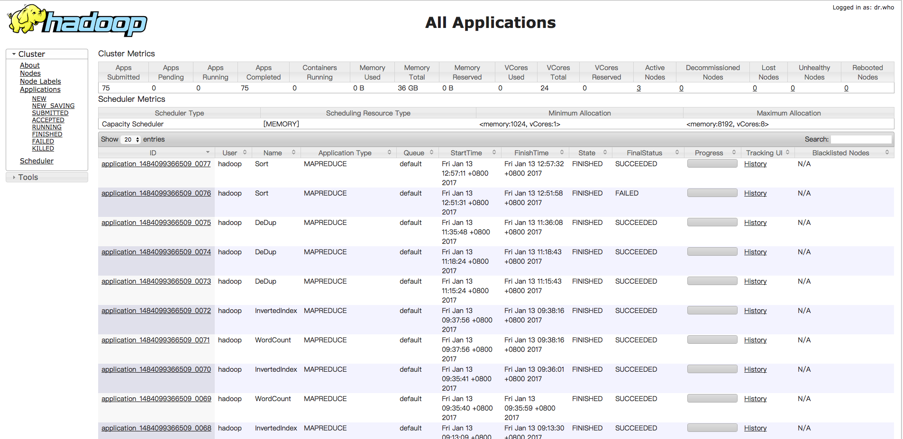

## Hadoop MapReduce 入门程序示例

#### 环境说明
> 开发工具：IntelliJ IDEA 16

> 系统：Mac 10.12.1

> Java 环境：JDK 7

> Hadoop 运行环境：CentOS 7

> Hadoop 版本：2.7.3

#### 项目结构说明

> cn.gitos.aurthur.Main.java
程序启动入口

> cn.gitos.aurthur.base
基本工具包

> cn.gitos.aurthur.mr
MapReduce 基本演示案例

> resources 包

包含 Hadoop 集群配置信息，其中 mapred-site.xml 中包含本项目打包后的 jar 包绝对路径，远程提交程序运行时使用！

####
任务提交后截图：

